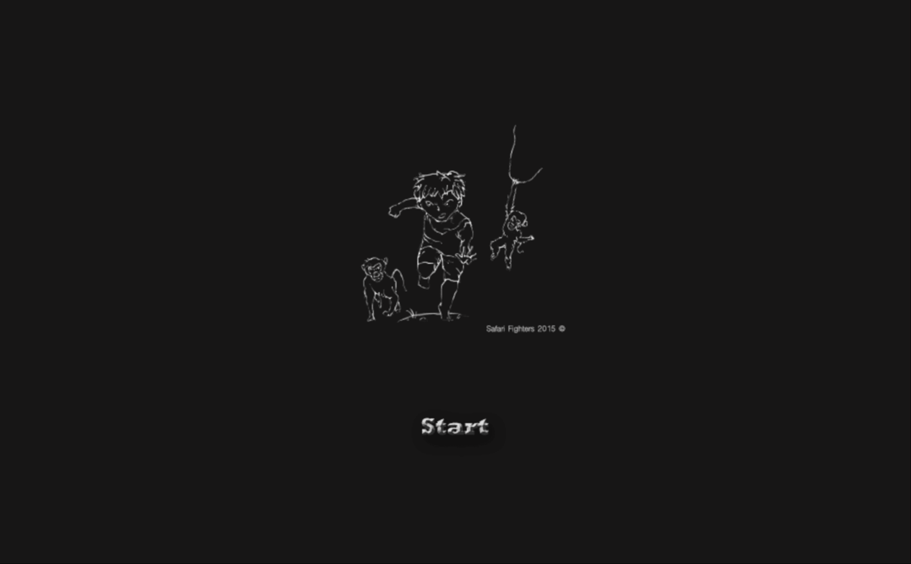

# Safari-Fighter

## About the Project
Safari Fighter is a 2D high-score survival game. You are trapped in a jungle labyrinth and must protect yourself from attacking apes by throwing coconuts at them. Survive as long as possible.

Originally created in 2015 and revised in 2024.

### Built With

The project was built using Java with Greenfoot. Greenfoot is well-suited for creating simple 2D games and simulations, providing an easy-to-use interface with JavaFX.

This project uses Java 8.

## Installation

### Use .jar with Local Java 8 Installation
If you already have a Java runtime environment for Java 8 installed on your computer, you can simply download the executable .jar file and run it directly.

Otherwise you can install a Java 8 runtime environment from any vendor that also includes JavaFX (e.g. Oracle: https://www.oracle.com/de/java/technologies/javase/javase8-archive-downloads.html or Amazon: https://docs.aws.amazon.com/corretto/latest/corretto-8-ug/downloads-list.html) and then run it.

If you are using Windows, you can alternatively use the bundled standalone version. It includes a Java 8 JRE, so you don't need to install anything yourself.

### Windows Standalone
Download the Windows standalone version and extract the .zip file. Run SafariFighter.exe to start the game.   **IMPORTANT**: Do not rename or move the jre folder. The .exe and this folder must be in the same directory!

## How to Play
When you run the game, you are greeted with the start screen. Press any button to continue and start the game.

In this game, you have to survive as long as possible from the apes trying to kill you. When they touch you, you lose a life. You start with three lives and lose one every time you get caught. If you have no lives left, it is game over. You can see your lives on the bottom left of the screen.

To protect yourself, you can throw coconuts at the apes. When you hit them, they disappear and your score increases by one. You can see your current score on the top right of the screen. Try to get as many points as possible!

The controls are as follows:

- <kbd>W</kbd>: Move up
- <kbd>A</kbd>: Move left
- <kbd>S</kbd>: Move down
- <kbd>D</kbd>: Move right
- <kbd>Space</kbd>: Throw coconut in the direction your character is facing

Have fun!

## Development
If you want to continue developing this game, you first have to install Greenfoot. As this project uses Java 8 and newer Greenfoot versions only support Java 17, you must use Greenfoot 3.7.1 or older. You can get it from their website (https://www.greenfoot.org/download_old).

Afterward, check out this repository, move to the folder <code>src</code>, and open <code>project.greenfoot</code>.

Now you can start adding more features to the project!

### Export Project as .jar
To export the project as a .jar file, press export in the top right corner of Greenfoot. Then select "Create an executable jar file that can be run on its own," choose a path where the jar should be saved, and press "export."

### Export Project as Windows Standalone
If you want to create a Windows standalone version, you have to export the project as a .jar first. Then install Launch4j (https://launch4j.sourceforge.net/). Open Launch4j and load the launch4jconfig.xml file provided in this repository. The config assumes the generated .jar file is named src.jar. If you renamed it, change it in the config. Press the gear icon to build the .exe. If you want to publish the Windows version, put the generated .exe file and the jre folder together in another folder and ship it like this.

## License
Distributed under the GPL-3.0 license. See <code>LICENSE</code> for more information.

## Acknowledgments
I'd like to give special thanks to the Greenfoot project, which helps students develop their first Java application in an easy and intuitive way.

- [Greenfoot](https://www.greenfoot.org/door)
